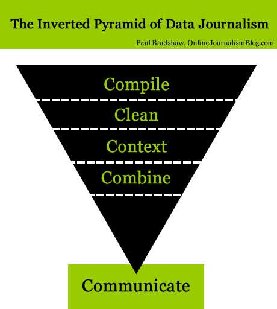

# Introduction: the inverted pyramid of data journalism

It's almost a decade since I published [The inverted pyramid of data journalism](https://onlinejournalismblog.com/2011/07/07/the-inverted-pyramid-of-data-journalism/). An attempt to identify the various skills and techniques involved in the practice, it has since been widely adopted by data journalism educators and used in data journalism research. So when it came to writing a book about the programming language R, I thought it would be a good idea to adopt the same model as a guiding framework.

The book is divided into five sections which mirror those in the model - from compiling data in the first place, to cleaning it, combining it, putting it into context and communicating the stories it. But data journalism often involves circling back: you may have to compile more data in order to combine it with existing dataset, or clean it; you often have to combine data to put it into context. So you'll find chapters where methods are combined too.

Along the way I will talk about some of the stories that I and others have been involved with as data journalists, and the many considerations that go beyond the technical. 

As a result, this isn't just a book about R, but about an editorial process that incorporates judgement calls about sources, best practice in data visualisation, writing conventions, and the role that audiences play in decisions.

This is a live book - I use the platform Leanpub for all my data journalism books because it allows me to update the book as new developments arise, I encounter new examples and tools - and as readers point out areas where the book may need improvement, correction or clarification. To that end, please let me know if you see anything in the book which needs fixing, or if you use the techniques in this book to tell your own stories - it's always great to see these techniques put into practice.
