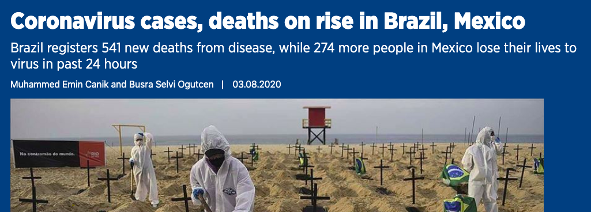

# Step 0: Conceive

Almost all data stories have two beginnings: the first is a conceptual beginning; the second is a technical one.

In a book on the technical skills of data journalism it is easy to overlook the editorial steps that come before the technical ones. So, although our book focuses on technical processes, I should emphasise that before even downloading data, it is important to complete some editorial preparation. 

My original inverted pyramid of data journalism was entirely focused on the practical aspects of data journalism - but there is a sixth 'C' that I should have included: **conceiving** the idea for the story you want to pursue.

Broadly speaking there are two modes of story conception: a **reactive** mode, whereby you are provided with the data and decide to look for a story in it; and a **proactive** mode, whereby you have an idea for a story, and begin collecting data that allows you to tell that story.

Reactive stories tend to be more routine, and common: new data releases from government departments, health bodies, and police and justice authorities, as well as publication of academic research and the conducting of commercial or PR surveys are all examples of scenarios where the journalist is reacting to new data. Because other journalists are generally also reacting to the same data, these stories tend to have to be produced at speed, in order to ensure that you aren't 'scooped' (someone else writes the same story) or your story ends up being old (because it was reported by other outlets already).

There are exceptions to that emphasis on speed: you might be offered exclusive access to a new data release, or it might be leaked to you by a source, but those are not the norm.

Proactive stories tend to take place over a longer timescale - partly because you need to actually obtain the data (in the reactive mode you already have it), and partly because you need to worry less about others scooping you or the story getting old. Those concerns still exist: if you've had the idea then there's a chance someone else has as well; particularly if it's based on a topical issue as most ideas are. And the topicality - or newsworthiness - of that idea may fade if you take too long to deliver it. 

For example, when a drone disrupted flights at Gatwick airport, the BBC Data Unit [decided to find out how many near-misses there had been in the last few years](https://www.bbc.co.uk/news/uk-40476264) to put that story into context. This was a proactive story, but the time available to do it was short (within the day), because that disruption would only be topical for a short period of time. 

In contrast, when we [decided to look at the impact of cuts on libraries](https://www.bbc.co.uk/news/uk-england-35707956), we knew that this was an issue which was still likely to be topical for months to come, so we were able to spend time sending FOI requests to authorities for data, and writing scripts to gather the data from other sources. 

The time available for an idea will shape both its conception and execution. When reacting to data releases, idea conception tends to be brief - most likely, the story idea will be to look for outliers, or ranking (which category is worst, or how does the local area perform in the latest figures), for evidence of any change in the issues that data measures (has unemployment gone up, for example), or to tell the story of the scale of a particular issue (how many people are homeless this year, for example). 

With proactive stories the journalists will have more time to scope out what data is available, discuss what angles they could pursue based on what is being measured (or not), begin analysis in order to find those stories, and then **re-conceive** if there isn't a story to tell. 

For example, if the initial idea is to look for change, and no meaningful or significant change is found, then the story might be re-conceived to be about the scale of an issue, or how much it varies between areas. One of the key skills of a journalist is to be able to adapt to the information that they are given - rather than rigidly sticking to any preconceptions - and still be able to tell a story about the information that they find.

## Editorial judgements and news values

Even when we are *reacting* to new data - for example reacting to the latest numbers of coronavirus cases in particular countries - an editorial process still exists. 

For example, as an organisation or a team we need to have decided that these numbers are newsworthy enough to report on a regular basis, and to monitor new data releases. This has involved a certain amount of **forward planning**.

As part of that we will have made an editorial judgement on the **authority and reliability** of that data, including any **caveats** we will need to include in reporting. 

Finally, we have considered our **audience** and the aspects of the data which we believe will be most relevant or interesting to them. 

[There are a number of dimensions at play here](https://www.owenspencer-thomas.com/journalism/newsvalues/), called news values, which have been identified and explored in a range of research. These include **proximity** (people are more interested in their own country than others), **impact** or **unexpectedness** (a big spike or drop, even in a distant country, for example) and 'currency' or **topicality** (an issue or area that is already in the news is more likely to be newsworthy. For example, if the president of Brazil is in the news already then his or her country's situation may have more topicality than other countries who haven't been in the news).

In [the example above, from the Turkish news agency Anadolu](https://www.aa.com.tr/en/latest-on-coronavirus-outbreak/coronavirus-cases-deaths-on-rise-in-brazil-mexico/1929940), the focus is on Brazil and Mexico. A clue to why those countries have been chosen is in the text itself: *"Brazil is seen as the epicenter of the COVID-19 outbreak in Latin America."* 

So with those conceptual beginnings outlined, it's time to start the technical work.

