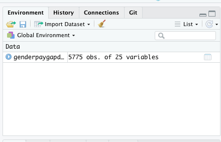
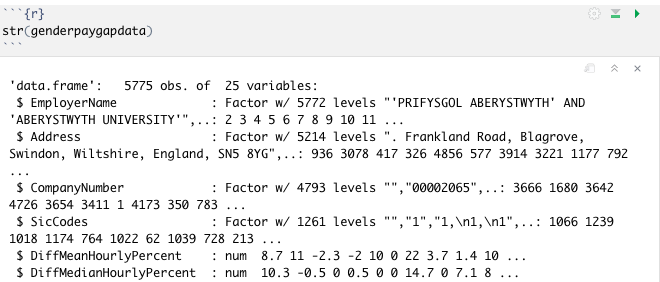
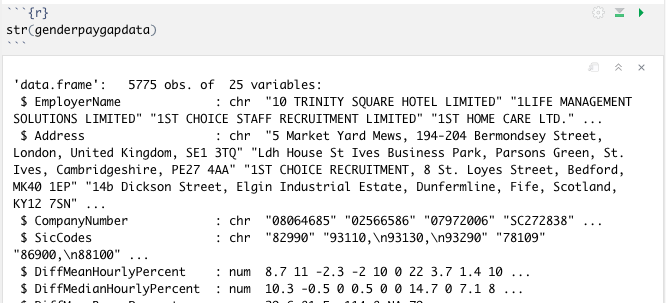

# Importing data into R and understanding different data types


In this chapter we will deal with a simple scenario: an annual update on some numbers.

New figures on gender pay at thousands of companies has been released, and after some editorial discussion you've decided to lead on the angle of how many companies have a gap in favour of men (you can [read an exåmple of a story taking this angle here](https://www.telegraph.co.uk/business/2018/04/05/final-gender-pay-gap-figures-revealed78pc-10015-firms-have-gap/) - it's always useful to do this to help you structure your own approach).

The data is available from a government website: the [gender pay gap service](https://gender-pay-gap.service.gov.uk/). Their website allows you to search for any individual company, but you can also click on a *[Download all gender pay gap data](https://gender-pay-gap.service.gov.uk/viewing/download)* link to get the data for any financial year.

That data comes in a format called **CSV**. We'll use that data to explore a number of core concepts in dealing with data using coding, including:

* Functions
* Variables
* 'Object' types, such as text strings, numbers, tables and lists
* Basic analysis and calculations

## Fetching data from a CSV

CSV is probably the most simple data format that you might deal with in R. CSVs are simple text files that can be read by any text-editing software - the file consists simply of rows of text where each piece of data is separated by a comma (CSV is short for Comma Separated Values). 

Unlike Excel spreadsheets, CSVs cannot contain multiple sheets, or information about any formulae - only the resulting values are kept.

We will look at spreadsheets and other data formats soon, but the CSV is a good file format to begin with in order to explore how data is imported and analysed in R, without having to deal with some of the additional challenges that more advanced formats bring with them.

## Introducing functions

To import a CSV into R, you need to use a **function**, called `read.csv()`.

Download a CSV file from the gender pay gap service's [Download gender pay gap data](https://gender-pay-gap.service.gov.uk/viewing/download) page. There is a file for every year - I've picked the [2019-20 data](https://gender-pay-gap.service.gov.uk/viewing/download-data/2019) because at the time of writing that's the last full year of data.

Once downloaded, it's important to **put the file in the same location as your R project**.

To import a CSV into R, you need to use a **function** - in this case, we are going to use one called `read.csv()`.

Functions are like recipes: a series of instructions for achieving a certain result. But instead of having to type all those instructions, you just use the name of the function (in the same way as you might say "use the cookie recipe" instead of giving someone a list of instructions each time). 

The `read.csv()` function, for example, is, not surprisingly, a recipe for reading CSV files.

Like recipes, functions normally have **ingredients**. For that reason, a function is always followed by a pair of parentheses, containing any ingredients that it needs (again, in the same way as you might say "use the cookie recipe, but add chocolate chips").

The term for those ingredients in R is ["parameters" or "arguments"](https://stackoverflow.com/questions/15463851/confused-about-r-terminology-attributes-parameters-and-arguments): when we talk about a function in general, for example, we might say it "takes two arguments" (two ingredients). 

When a function is used, then, it might look something like this: 

`myfunction(the_first_argument)`

If it has more than one ingredient then each argument is separated by a comma, like so:

`myfunction(the_first_argument, the_second_argument)`

The code below, then, uses the **path to** the the CSV file (including its name) as the *argument* for the function `read.csv()`.

```{r}
read.csv("UK Gender Pay Gap Data - 2019 to 2020.csv")
```

T> Note that the path to the file needs to be in quotation marks and include the file extension (.csv). In this case the path to the file is simply the name of the file - this is because it's already in the same folder as your project, as we recommended. However, if you chose to create a folder called 'data' inside your project folder, and put the data there, we'd have to include that in the path like so:
T> 
T> `read.csv("data/UK Gender Pay Gap Data - 2019 to 2020.csv")`

If you run this code then RStudio will *read* the data in that CSV and show it to you - but you won't be able to do anything with it.

Why? Because in order to *do* anything with data in coding you need to first *store* it - in something called a **variable**.

## Storing data in variables

A **variable** is an object that stores information in your code, in the same way as a spreadsheet cell might store different pieces of information in a spreadsheet.

Just as spreadsheet cells are given names like "A1" or "C3" (and [you can also give them custom names](https://support.microsoft.com/en-us/office/define-and-use-names-in-formulas-4d0f13ac-53b7-422e-afd2-abd7ff379c64)), variables are given names too.

> W: You cannot use an underscore in R, which instead tends to use a dot to separate words in variables. You should also avoid using one-letter functions as these already have special meanings in R: c, q, s, t, C, D, F, I, and T.*

Variables in coding, however, can contain much more complex information than can be stored in one spreadsheet cell. For example, a variable can contain a whole table, or a whole column of values, as well as just a single number or string of text.

The first time that you create a variable you need to give it a name, and **assign** a value to the variable.

This is done by putting the name of your variable, followed by the characters `<-` (think of it as an arrow pointing left, at that name), followed by what you want to store in that variable. Sometimes the value you want to store is very obvious, like so:

`myname <- "Paul"`

In this example the string of letters "Paul" is assigned to the variable called `myname`.

But if you are using code to generate information - like when importing data - you can also assign the **results** of some code to a variable, like so:

`yourvariable <- read.csv('yourdata.csv')`

In that example the results of applying the `read.csv()` function to the file 'yourdata.csv' are assigned to the variable called `yourvariable`.

The bit that says `yourvariable` is just a name that you choose. It can be almost anything, but choose something meaningful.

To **store** the gender pay gap, then, we need to adapt the code to read like this:

```{r}
genderpaygapdata <- read.csv("UK Gender Pay Gap Data - 2019 to 2020.csv")
```

In the code above we've added `genderpaygapdata <- ` to assign the results of that code to a new variable called `genderpaygapdata`.

T> If you don't know where the file is you can use `file.choose()`
T> 
T> This will make a window pop up which you can then use to navigate to the file that you need. The result will be a path to that file that you can copy and paste into a command like the `read.csv()` command shown above. However, note that this path may stop working later on if you move or change the file or any of the folders involved - it's always best to keep your data files in the same directory as your R project.

You can tell that data has been stored in a variable in RStudio by looking in the *Environment* area in the upper right corner. Your new variable should now be listed there - and any new variables will be added there too. Data in particular will be ordered to appear at the top of the list.



## Data types

When you import a CSV or other spreadsheet into R, it is stored in a particular *type* of variable, called a **data frame**. Data frames are basically tables - it is a type of variable that has rows and columns - but there is one important distinction to note: 

In a data frame a column can only contain *one type* of information. For example: all numbers, or all text. In spreadsheets, of course, you might have a column where some cells contain numbers and others contain text but that's not possible in a data frame: instead, a column with such a mix will be treated as if *all* the cells contained text. We will talk more about this distinction later.

First, now that we have the data stored in R, we can start to explore the different types of data within it.

A quick way to do that is with another function: `str()`.

The `str()` function tells you the **structure** of your data frame - including types of information. The one ingredient it needs is the name of the data frame, like so:

```{r}
str(genderpaygapdata)
```

Running this function will give you ("return" to you) a line telling you what type of object it is ("data frame") and how many rows and columns there are ("5775 obs. of  25 variables"). Note that rows are called "observations" and columns are called "variables".

This is followed by a series of lines with details on each column. The first column, for example, is `$ EmployerName: Factor w/ 5772 levels`, and the fifth column is `$ DiffMeanHourlyPercent: num`.



What does this mean?

* The dollar sign indicates that we are dealing with a column, or 'variable' - more on this later.
* Then we have the name of that column: EmployerName, for example
* We then have `Factor` or `num`. The `num` means it's a **numeric** column: `DiffMeanHourlyPercent`, for example, contains only numbers. But `Factor` needs some more explanation...

### Explaining factors

Factors are basically columns of categorical data. A column with only "male" or "female", for example, is a classic example of a factor. As [Hadley Wickham puts it in the book R for Data Science](https://r4ds.had.co.nz/factors.html):

> "In R, factors are used to work with categorical variables, variables that have a fixed and known set of possible values. They are also useful when you want to display character vectors in a non-alphabetical order.

> "Historically, factors were much easier to work with than characters. As a result, many of the functions in base R automatically convert characters to factors. This means that factors often crop up in places where they’re not actually helpful."

If we look at our data we can see that's happened here: 'Employer Name' isn't really a factor - there are as many names as there are rows, and the same applies to address and company number. An argument could be made that SIC codes (codes that categorise the sector that a company operates in) are factors, but in practical terms we don't really want them stored that way. And indeed, the situations where we do want information stored as factors are relatively rare.

Luckily we can stop that happening.


### Ensuring text data is not stored as factors

When Hadley Wickham talks about "many of the functions in base R" he is referring to functions like `read.csv()`. And although this "automatically" convert characters to factors, we can add extra instructions - parameters - to that function to specify that we want it to behave differently.

One important one is `stringsAsFactors=FALSE`. This prevents character columns being treated as 'factors', or numeric columns containing non-numeric values (like #N/A) being treated as 'factors' when you want them to be treated as numbers. ([more on factors here](https://blog.exploratory.io/why-factor-is-one-of-the-most-amazing-things-in-r-e967fe27d292))

Add it with a comma inside the parentheses like so:

```{r}
genderpaygapdata <- read.csv("UK Gender Pay Gap Data - 2019 to 2020.csv", stringsAsFactors=FALSE)
```

Note that we've used the same variable name, so this will **overwrite** the variable we created earlier when we imported it the first time round.

Now try `str()` to see if the structure is different:

```{r}
str(genderpaygapdata)
```



This time those first few columns are no longer `Factor` but instead `chr`, or **character** types - in other words normal text. That's how we want it.

## Useful links

For importing other files see Sharon Machlis's article [Great R packages for data import, wrangling and visualization](http://www.computerworld.com/article/2921176/business-intelligence/great-r-packages-for-data-import-wrangling-visualization.html).

Once you've got it into a variable you can do all sorts of other things with it, as we'll see...
