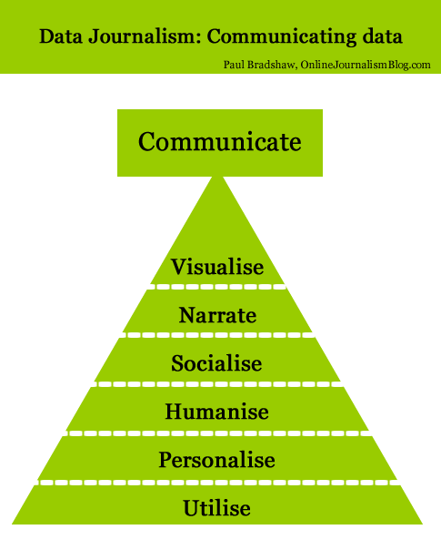
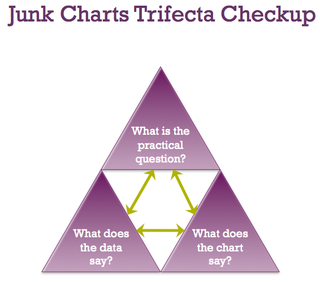

# Section 5: Communicate

Modern data journalism has grown up alongside an enormous growth in visualisation, and this can sometimes lead us to overlook different ways of telling stories involving big numbers. 

So although the chapters that follow in this section deal with *visualisation* as a method of communicating data journalism stories - it should not be your default approach. Other approaches, outlined below, have other strengths and weaknesses, and you should always consider carefully which combination is the best way to communicate the story you are trying to tell. 

## Visualisation

Visualisation is often the quickest way to communicate the results of data journalism: within R we can generate a chart or map without having to leave the tool, and we can simply export and copy the data into free tools such as Datawrapper, Infogram or Flourish to select from a range of visualisation options.

But ease does not equal effectiveness. The rise of [chartjunk](https://infovis-wiki.net/wiki/Chart_Junk) illustrates that visualisation is not immune to churnalism or spectacle without insight.

There is a rich history of print visualisation which remains relevant to the generation of online infographics: focusing on no more than 4 data points; avoiding 3D and ensuring the graphic is self-sufficient are just some.

[Kaiser Fung’s trifecta](https://junkcharts.typepad.com/junk_charts/2010/05/junk-charts-talk.html) is one useful reference point for ensuring a visualisation is effective, and [this explanation of how a chart was transformed into something that could be used in a newspaper is also instructive](https://statmodeling.stat.columbia.edu/2009/11/19/senators_and_he/) ([summarised by Kaiser Fung here](https://junkcharts.typepad.com/junk_charts/2009/11/worthy-of-the-times.html)).

In short: it’s not a simple process.

Visualisation has one major advantage which makes that effort worthwhile, however: it can make communication incredibly effective. And it can provide a method of distributing your content which cannot be matched by the other types of communication listed here.

But its major strength is also its main weakness: the instant nature of infographics also means that people often do not spend much time looking at it. It makes it very effective for distribution, but not for engagement, and so it is worth thinking strategically about 1) making sure the image contains a link back to its source; and 2) making sure that there is something more at the source when people arrive.

